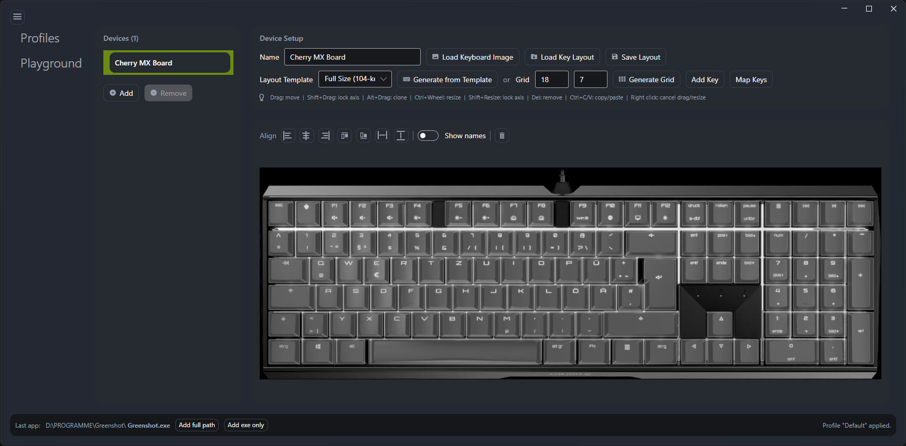
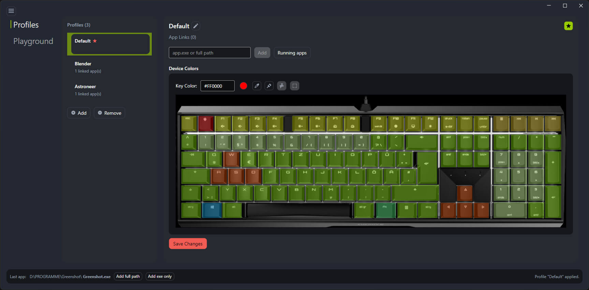

# Cherry Key Layout [](https://www.paypal.com/donate/?hosted_button_id=VT4P4AT8FTYDL)
A modern GUI editor for CHERRY RGB keyboard profiles with a lightweight C# HID backend. Build and edit layouts, map hardware keys, and manage per‑app profiles without the official CHERRY Utility.

## WHY?

I created this software out of curiosity and because I was shocked by how the official Cherry keyboard utility/software is implemented. The main problem was that when switching from an app with a profile to any other app the lighting of the keyboard did not switch to a default state/profile of some sort. It got stuck to the last profile used. Totally not understandable!

## Highlights

- Visual profile editor with live key coloring
- Device layout designer (import image + define keys)
- Profile auto‑switching by active app
- Tray app with quick access
- CLI for scripting and automation

## Install (Windows)

1. Download the latest Windows release ZIP from GitHub Releases.
2. Extract the ZIP.
3. Run `CherryKeyLayout.Gui.exe`.

## Build and run (dev)

For development builds:

```powershell
dotnet run --project .\\CherryKeyLayout.Gui
```

### Screenshots




## CLI

The CLI is still available for scripting:

```powershell
dotnet run --project .\\CherryKeyLayout -- --mode static --color #00FFAA --brightness full
dotnet run --project .\\CherryKeyLayout -- --mode wave --color #FF00FF --brightness high --speed slow
```

### Animation examples

```powershell
dotnet run --project .\\CherryKeyLayout -- --mode breathing --color #00A0FF --brightness medium --speed medium
dotnet run --project .\\CherryKeyLayout -- --mode rolling --color #FFAA00 --brightness high --speed slow
dotnet run --project .\\CherryKeyLayout -- --mode spectrum --brightness full --speed fast
```

## Build

```powershell
dotnet build .\\CherryKeyLayout.Gui
```

## Releases (Windows)

```powershell
.\scripts\publish_windows.ps1
```

The output zip will be created in `dist\\CherryKeyLayout-win-x64.zip`.

## License

MIT - see `LICENSE`.

---

**Made with ❤️ and 🧠 and 🤖 for the 3D printing community.**
If this project helps you creating even more awesome 3D prints and if you want to help us improve this and other tools, you can sponsor us a cup of :coffee: - or two! :)
[donate](https://www.48design.com/donate/)

---
